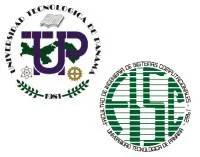
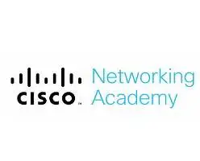
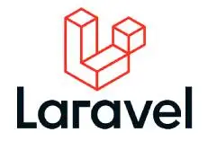

<!-- University -->
## Universidad Tecnológica de Panamá
- *Licenciatura en Desarrollo de Software* | Ene'18 - May'22
- 
- Tags: Licenciatura
- Badges:
  - []
- List Items:
  - Proveer al mercado nacional de especialistas capaces de diseñar, programar y administrar sistemas informáticos.

## Universidad Tecnológica de Panamá
- *Maestría en Seguridad Informática* | May'23 - Actualmente
- 
- Tags: Maestría
- Badges:
  - []
- List Items:
  - Dotar al mercado nacional de especialistas en Seguridad de la Información, capaces de aplicar tecnologías de seguridad, identificando medidas para defender y mejorar la seguridad de las organizaciones.

<!-- ## Universidad Tecnológica de Panamá
- *Postgrado / Maestría en Ingeniería del Software* | May'23 - Actualmente
- 
- Tags: Maestría
- Badges:
  - []
- List Items:
  - Aplicar tecnologías de seguridad, identificar medidas para defender y mejorar la seguridad de las organizaciones. -->

<!-- Courses -->
## Cisco Networking Academy
- *Introducción a la Ciberseguridad* | Ago'19 - Sep'19
- 
- Tags: Cursos
- Badges:
  - []
- List Items:
  - Describir las tácticas, técnicas y procedimientos utilizados por los ciberdelincuentes.
  - Describir los principios de confidencialidad, integridad y disponibilidad en relación con los estados de los datos y las contramedidas de ciberseguridad.
  - Describir las tecnologías, productos y procedimientos utilizados para proteger la confidencialidad, garantizar la integridad y proporcionar una alta disponibilidad.
  - Explicar cómo los profesionales de la ciberseguridad utilizan tecnologías, procesos y procedimientos para defender todos los componentes de la red.
  - Explicar el propósito de las leyes relacionadas con la ciberseguridad.

## Cisco Networking Academy
- *Cybersecurity Essentials* | Jul'19 - Oct'19
- 
- Tags: Cursos
- Badges:
  - []
- List Items:
  - Conceptos e importancia de la ciberseguridad.
  - Características e impacto de los distintos tipos de ciberataques.
  - Cómo protegerse contra los ciberataques.
  - Técnicas utilizadas para proteger a las organizaciones de los ciberataques.

## Universidad Tecnológica de Panamá
- *Curso Laravel* | Ene'19 - Mar'19
- 
- Tags: Cursos
- Badges:
  - []
- List Items:
  - Crea aplicaciones web profesionales con Laravel.

## Udemy
- *JavaScript Moderno* | Feb'21 - Abr'21
- 
- Tags: Cursos
- Badges:
  - []
- List Items:
  - El objetivo principal del curso es enseñarte JavaScript moderno, partiendo de cero conocimientos en JavaScript para llevarte a un nivel avanzado y competitivo en el mercado laboral actual.

## Udemy
- *Unity* | Jul'18 - Nov'18
- 
- Tags: Cursos
- Badges:
  - []
- List Items:
  - Conocer y aplicar los fundamentos del proceso creativo del videojuego.

## Udemy
- *ReactJS de cero a experto* | Ene'23 - Feb'23
- 
- Tags: Cursos
- Badges:
  - []
- List Items:
  - Desarrollo de interfaces de usuario dinámicas y reutilizables.