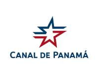
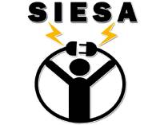
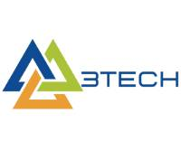

## Panama Canal Authority
- *Full-stack Developer* | Sep'21 - Mar'22
- 
- Tags: Professional Practice
- Badges:
  - [blue]
- List Items:
  - Requirements assessment. (Jira Software)
  - Desktop application development. (VB, SQL Server)
  - Web application development. (.Net, MVC, C#, SQL Server)

## Electrical Solutions and Integrations S.A. (SIESA)
- *Full-stack Developer* | Feb'19 - Currently
- 
- Tags: Full-stack
- Badges:
  - [blue]
- List Items:
  - Development of different projects.

## 3Tech
- *Full-stack Developer* | Sep'22 - Currently
- 
- Tags: Full-stack
- Badges:
  - [blue]
- List Items:
  - Ecommerce WebApp Development (Wordpress).
  - App Development.

## CrimsonLogic Latin America
- *Back-end Developer* | May'22 - Currently
- 
- Tags: Back-end
- Badges:
  - [blue]
- List Items:
  - Optimization of the different applications in pre-production.