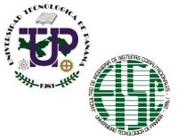

## Technological University of Panama - UTP
- *Bachelor's Degree in Software Development* | Jan'18 - May'22
- 
- List Items:
  - To provide the national market with specialists capable of designing, programming and managing computer systems.

## Technological University of Panama - UTP
- *Master's Degree in Information Security* | May'23 - Currently
- 
- List Items:
  - To provide the national market with specialists in Information Security, capable of applying security technologies, identifying measures to defend and improve the security of organizations.

<!-- ## Technological University of Panama - UTP
- *Master's Degree in Information Security* | May'23 - Currently
- 
- List Items:
  - Apply security technologies, identify measures to defend and improve the security of organizations. -->