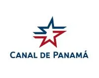
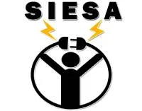
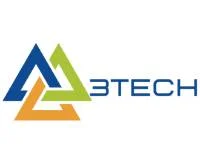
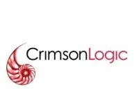

## Autoridad del Canal de Panamá
- *Desarrollador Full-stack* | Sep'21 - Mar'22
- 
- Tags: Práctica Profesional
- Badges:
  - [blue]
- List Items:
  - Levantamiento de Requerimientos. (Software Jira)
  - Desarrollo de aplicaciones de escritorio. (VB.NET, SQL Server)
  - Desarrollo de aplicaciones web. (.NET, MVC, C#, SQL Server)

## Soluciones e Integraciones Eléctricas, S.A. - SIESA
- *Desarrollador Full-stack* | Feb'19 - Actualmente
- 
- Tags: Full-stack
- Badges:
  - [blue]
- List Items:
  - Desarrollo de diferentes proyectos.

## 3Tech
- *Desarrollador Full-stack* | Sep'22 - Actualmente
- 
- Tags: Full-stack
- Badges:
  - [blue]
- List Items:
  - Desarrollo de aplicaciones web e-commerce. (Wordpress)
  - Desarrollo de aplicaciones.

## CrimsonLogic Latin America
- *Desarrollador Back-end* | Mar'22 - May'23
- 
- Tags: Back-end
- Badges:
  - [blue]
- List Items:
  - Optimización de las distintas aplicaciones web en preproducción.