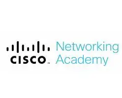

<!-- University -->
## Technological University of Panama
- *Bachelor's Degree in Software Development* | Jan'18 - May'22
- 
- Tags: Degree
- Badges:
  - []
- List Items:
  - To provide the national market with specialists capable of designing, programming and managing computer systems.

## Technological University of Panama
- *Master's Degree in Information Security* | May'23 - Currently
- 
- Tags: Master
- Badges:
  - []
- List Items:
  - To provide the national market with specialists in Information Security, capable of applying security technologies, identifying measures to defend and improve the security of organizations.

<!-- ## Technological University of Panama
- *Master's Degree in Information Security* | May'23 - Currently
- 
- Tags: Master
- Badges:
  - []
- List Items:
  - Apply security technologies, identify measures to defend and improve the security of organizations. -->

<!-- Courses -->
## Cisco Networking Academy
- *Introduction to Cybersecurity* | Aug'19 - Sep'19
- 
- Tags: Courses
- Badges:
  - []
- List Items:
  - Describe the tactics, techniques and procedures used by cybercriminals.
  - Describe the principles of confidentiality, integrity, and availability as they relate to data states and cybersecurity countermeasures.
  - Describe technologies, products and procedures used to protect confidentiality, ensure integrity and provide high availability.
  - Explain how cybersecurity professionals use technologies, processes and procedures to defend all components of the network.
  - Explain the purpose of laws related to cybersecurity.

## Cisco Networking Academy
- *Cybersecurity Essentials* | Jul'19 - Oct'19
- 
- Tags: Courses
- Badges:
  - []
- List Items:
  - Concepts and importance of cybersecurity.
  - Characteristics and impact of various types of cyber attacks.
  - How to protect against cyber attacks.
  - Techniques used to protect organizations from cyber attacks.

## Technological University of Panama
- *Laravel Course* | Jan'19 - Mar'19
- 
- Tags: Courses
- Badges:
  - []
- List Items:
  - Create professional web applications with Laravel.

## Udemy
- *Modern JavaScript* | Feb'21 - Apr'21
- 
- Tags: Courses
- Badges:
  - []
- List Items:
  - The main objective of the course is to teach you modern JavaScript, starting from zero knowledge in JavaScript to take you to an advanced and competitive level in today's job market.

## Udemy
- *Unity* | Jul'18 - Nov'18
- 
- Tags: Courses
- Badges:
  - []
- List Items:
  - Know and apply the fundamentals of the creative process of the video game.

## Udemy
- *ReactJS from zero to expert* | Jan'23 - Feb'23
- 
- Tags: Courses
- Badges:
  - []
- List Items:
  - Development of dynamic and reusable user interfaces.